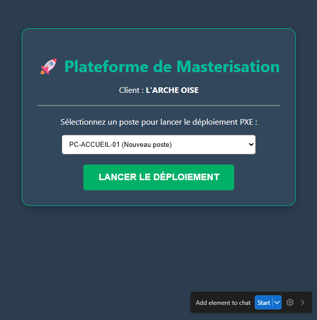

# 🚀 Projet de Masterisation - L'ARCHE OISE
### BTS CIEL 2026 - Revue n°1 (17 Février)

## 📋 Contexte du projet
L'entreprise **L'ARCHE OISE** prévoit le renouvellement de nombreux PC fixes et portables en 2026. Actuellement, l'installation manuelle prend trop de temps (1h30/poste) et génère des erreurs.

## 🛠️ Solution proposée
Déploiement d'une infrastructure **FOG Project** pour :
* La capture d'images système.
* Le déploiement automatisé via **PXE**.
* Le développement d'une **interface web simplifiée** pour les techniciens.

## ⚙️ Automatisation (Scripts PowerShell)
Nous avons développé deux scripts de post-installation pour répondre aux besoins spécifiques du parc :
1. **PC Fixe (`post-install-fixe.ps1`)** : 
   - Configuration IP Statique (pour la prise en main via **UltraVNC**).
   - Installation : Chrome, LibreOffice, UltraVNC, ESET.
2. **PC Portable (`post-install-portable.ps1`)** : 
   - Configuration DHCP (pour la mobilité/Wi-Fi).
   - Installation : Chrome, LibreOffice, ESET.

## ✅ État d'avancement (Février 2026)
- [x] Analyse des besoins et contexte L'ARCHE OISE.
- [x] Maquette de l'interface de pilotage validée (HTML/CSS).
- [x] Scripts de post-déploiement rédigés et testés.
- [ ] Installation de la VM Serveur FOG (Prochaine étape).

---
*Développé par Noan Moerkerke - Projet BTS CIEL IR*